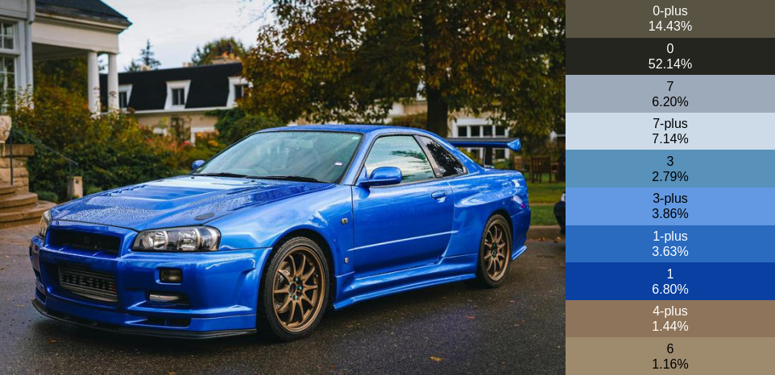

# by16

A trivial linear-time algorithm to compute the average colors of an image, grouped
into clusters based on their 4-bit color representation.

This algorithm is designed for speed rather than flexibility or quality. It uses
16 fixed clusters (based on 4-bit color, i.e. 2⁴ combinations) and can process
images at runtime with minimal overhead.

